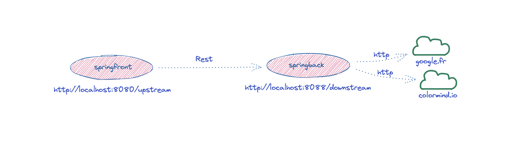
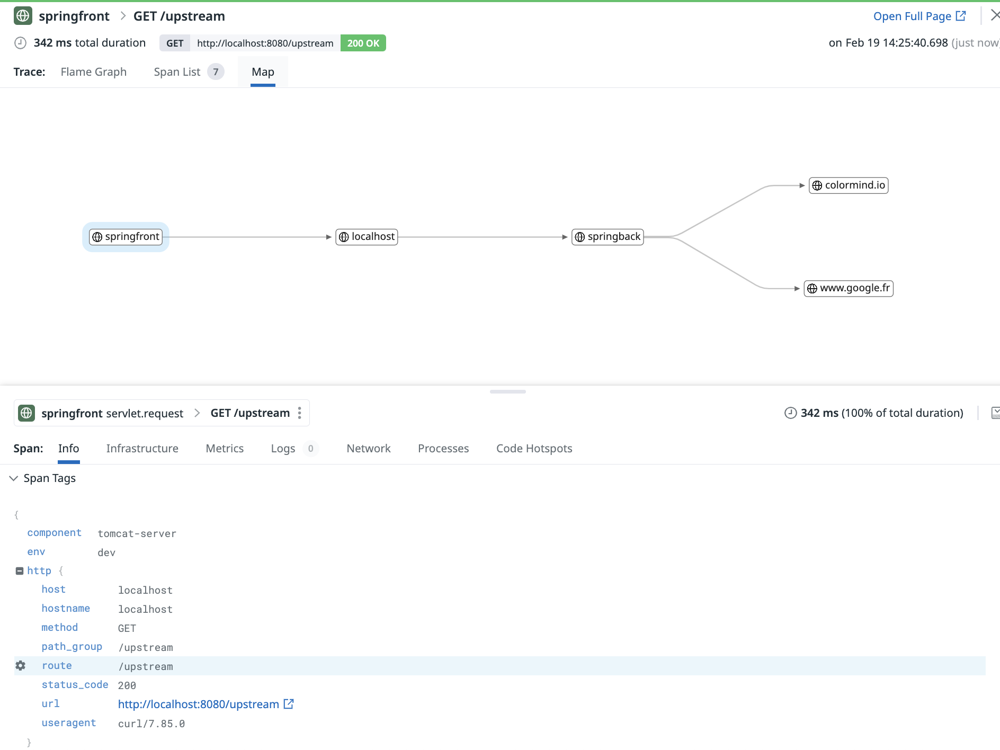

# Instrumenting a spring boot application using Datadog


## Introduction


The sections of this tutorial are structured as follows

* Goal
* Pre-requisites
* Clone the repository
* Directory structure of the [project](#project)
* Overview of the [application](#app)
* Building the application and running it [locally](#local).
* Building the docker images and run the application through [docker](#docker) (Optional).
* Testing the application and generating [load](#load)
* Building the application and running it on a [kubernetes](#k8s) cluster
  * Instrumenting app in k8s through [manual](#manual) configuration
  * Instrumenting app in k8s through lib [injection](#injection) 
* End

In each section, we'll describe the required steps to take in order to reach the goal.


## Goal of this lab


The purpose of this lab is to help familiarizing and practising the various steps required to set up a spring boot application using Rest and start instrumenting it with Datadog

<p align="left">
  
</p>


## Pre-requisites


+ About 90 minutes
+ A java JDK (If building & running locally). Ex OpenJDK 11 or above
+ Gradle installed (If building & running locally). Ex Gradle 7.5.1
+ Git client
+ A Datadog account with a valid API key
+ Your favorite text editor or IDE (Ex Sublime Text, Atom, vscode...)
+ Docker and docker-compose.
+ Having `gcloud` installed or any cloud platform equivalent (for Azure, AWS, Alibaba)


## Clone the repository


<pre style="font-size: 12px">
[root@pt-instance-6:~/]$ git clone https://github.com/ptabasso2/springblog
[root@pt-instance-6:~/]$ cd springblog
[root@pt-instance-6:~/springblog]$ 
</pre>


## Directory structure of the <a name="project"></a>project


The example below is the structure after having clone the project.

```shell
[root@pt-instance-6:~/springblog]$ tree
.
├── Dockerfiles
│   ├── Dockerfile.springback
│   ├── Dockerfile.springfront
├── README.md
├── dd-java-agent.jar
├── docker-compose.yml
├── img
├── springback
│   ├── build.gradle
│   ├── gradle
│   │   └── wrapper
│   │       ├── gradle-wrapper.jar
│   │       └── gradle-wrapper.properties
│   ├── gradlew
│   ├── logs
│   │   └── springback.log
│   ├── settings.gradle
│   └── src
│       └── main
│           ├── java
│           │   └── com
│           │       └── datadog
│           │           └── pej
│           │               └── back
│           │                   ├── BasicController.java
│           │                   ├── Quote.java
│           │                   ├── SpringBackApplication.java
│           │                   ├── Value.java
│           └── resources
│               └── application.yml
└── springfront
    ├── build.gradle
    ├── gradle
    │   └── wrapper
    │       ├── gradle-wrapper.jar
    │       └── gradle-wrapper.properties
    ├── gradlew
    ├── settings.gradle
    └── src
        └── main
            ├── java
            │   └── com
            │       └── datadog
            │           └── pej
            │               └── front
            │                   ├── BasicController.java
            │                   ├── Quote.java
            │                   ├── SpringFrontApplication.java
            │                   └── Value.java
            └── resources
                └── application.yml

```

## Overview of the <a name="app"></a>application


The main components of this project can be described as follows:
+ Two distinct microservices (`springfront` and `springback`) communicating with each other through Rest. The backend service in turn does a bit of processing and issues two external http calls  </br>
+ The various docker files needed to build the images and the `docker-compose` configuration file to spin up the three containers (`dd-agent-dogfood-jmx`, `springfront`, `springback`).


## Building <a name="local"></a> the application and running it locally.

These steps assume that you have a JDK installed and configured for your environment. This tutorial has been tested with `OpenJDK 11.0.12`.
And you will also need to have gradle installed, the version used in this example is `7.5.1` 

If you wish to simply run and test the application, you may skip this section and consider the dockerized version of the [application](#docker). The necessary images are provided and available in a `dockerhub` registry. 

### Starting the Datadog Agent first ###

First set your API Key:

````shell
[root@pt-instance-6:~/springblog]$ export DD_API_KEY=<Your api key>
````

Then let's run the agent. As docker is installed on our environment, we will use a dockerized version of the agent. 

But if you wish to have it deployed as a standalone service you will want to follow the instructions as per [Datadog Agent installation](https://app.datadoghq.com/account/settings?_gl=1*17qq65s*_gcl_aw*R0NMLjE2NzY0Mzg4NTcuQ2p3S0NBaUFfNnlmQmhCTkVpd0FrbVh5NTcxNlplWmxIQ3RBS0MwdWdUeWIyNnZSRGN1Q01YUHJoZHlYU2Zaekt4eTNNZjZST1I4SVVSb0NwT2NRQXZEX0J3RQ..*_ga*NzYyNTQxODI3LjE2MDExNDI4ODA.*_ga_KN80RDFSQK*MTY3NjgwOTY3NS4zMC4xLjE2NzY4MDk3MDQuMzEuMC4w#agent/ubuntu)


By default, the Datadog Agent is enabled in your `datadog.yaml` file under `apm_config` with `enabled: true` and listens for trace data at `http://localhost:8126`


````shell
[root@pt-instance-6:~/springblog]$ docker run -d --network app --name dd-agent-dogfood-jmx -v /var/run/docker.sock:/var/run/docker.sock:ro \
-v /proc/:/host/proc/:ro \
-v /sys/fs/cgroup/:/host/sys/fs/cgroup:ro \
-v /home/pej/conf.d/:/etc/datadog-agent/conf.d \
-p 8126:8126 -p 8125:8125/udp \
-e DD_API_KEY \
-e DD_APM_ENABLED=true \
-e DD_APM_NON_LOCAL_TRAFFIC=true -e DD_PROCESS_AGENT_ENABLED=true -e DD_DOGSTATSD_NON_LOCAL_TRAFFIC="true" -e DD_LOG_LEVEL=debug \
-e DD_LOGS_ENABLED=true \
-e DD_LOGS_CONFIG_CONTAINER_COLLECT_ALL=true \
-e DD_CONTAINER_EXCLUDE_LOGS="name:datadog-agent" \
-e SD_JMX_ENABLE=true \
gcr.io/datadoghq/agent:latest-jmx
Unable to find image 'gcr.io/datadoghq/agent:latest-jmx' locally
latest-jmx: Pulling from datadoghq/agent
8dbf11a29570: Pull complete 
Digest: sha256:c7fe7c8d15f259185ab0c60dbfb7f5cbc67d09b5749af0d2fee45cefe2ccb05f
Status: Downloaded newer image for gcr.io/datadoghq/agent:latest-jmx
2d1eec89c2196d298d1e3edf1e9f879c0fc3be593d96f1469cfacc2cacfc18b4
````

In order to instrument our services, we will also need to use a java tracing library (`dd-java-agent.jar`). 
 
To install the java tracing client, download `dd-java-agent.jar`, which contains the Agent class files
`wget -O dd-java-agent.jar 'https://dtdg.co/latest-java-tracer'`

But you can skip this as the client is already available in this repo. Now let's build, instrument and run our services.


### Building and running **springback** ###

````shell
[root@pt-instance-6:~/springblog]$ cd springback
[root@pt-instance-6:~/springblog/springback]$ gradle build

BUILD SUCCESSFUL in 10s
[root@pt-instance-6:~/springblog/springback]$ nohup java -jar springback/build/libs/spring-back.jar --server.port=8088 &
[1] 19870
[root@pt-instance-6:~/springblog/springback]$ nohup: ignoring input and appending output to 'nohup.out'
````

We can check that the service is running by taking a look at content of the `nohup.out`

````shell
[root@pt-instance-6:~/springblog/springback]$ cat nohup.out

  .   ____          _            __ _ _
 /\\ / ___'_ __ _ _(_)_ __  __ _ \ \ \ \
( ( )\___ | '_ | '_| | '_ \/ _` | \ \ \ \
 \\/  ___)| |_)| | | | | || (_| |  ) ) ) )
  '  |____| .__|_| |_|_| |_\__, | / / / /
 =========|_|==============|___/=/_/_/_/
 :: Spring Boot ::                (v2.6.1)

2023-02-19 12:42:30 [main] INFO  c.d.pej.back.SpringBackApplication -   - Starting SpringBackApplication using Java 11.0.12 on pt-instance-6 with PID 19870 (/root/springblog/springback/build/libs/spring-back.jar started by root in /root/springblog)
2023-02-19 12:42:30 [main] INFO  c.d.pej.back.SpringBackApplication -   - No active profile set, falling back to default profiles: default
2023-02-19 12:42:32 [main] INFO  o.s.b.w.e.tomcat.TomcatWebServer -   - Tomcat initialized with port(s): 8088 (http)
2023-02-19 12:42:32 [main] INFO  o.a.catalina.core.StandardService -   - Starting service [Tomcat]
2023-02-19 12:42:32 [main] INFO  o.a.catalina.core.StandardEngine -   - Starting Servlet engine: [Apache Tomcat/9.0.55]
2023-02-19 12:42:32 [main] INFO  o.a.c.c.C.[Tomcat].[localhost].[/] -   - Initializing Spring embedded WebApplicationContext
2023-02-19 12:42:32 [main] INFO  o.s.b.w.s.c.ServletWebServerApplicationContext -   - Root WebApplicationContext: initialization completed in 1556 ms
2023-02-19 12:42:33 [main] INFO  o.s.b.w.e.tomcat.TomcatWebServer -   - Tomcat started on port(s): 8088 (http) with context path ''
2023-02-19 12:42:33 [main] INFO  c.d.pej.back.SpringBackApplication -   - Started SpringBackApplication in 3.324 seconds (JVM running for 3.994)
2023-02-19 12:42:33 [main] INFO  c.d.pej.back.SpringBackApplication -   - test

````

The service is started and listens on port `8088` and exposes an endpoint `/downstream` that will be hit by the `springfront` service. 
Let's now build and test `springfront`


### Building and running **springfront** ###

````shell
[root@pt-instance-6:~/springblog/springback]$ cd ../springfront
[root@pt-instance-6:~/springblog/springfront]$ gradle build

BUILD SUCCESSFUL in 7s
[root@pt-instance-6:~/springblog/springfront]$ nohup java -jar build/libs/spring-front.jar &
[1] 20545
[root@pt-instance-6:~/springblog/springfront]$ nohup: ignoring input and appending output to 'nohup.out'

[root@pt-instance-6:~/springblog/springfront]$ cat nohup.out

  .   ____          _            __ _ _
 /\\ / ___'_ __ _ _(_)_ __  __ _ \ \ \ \
( ( )\___ | '_ | '_| | '_ \/ _` | \ \ \ \
 \\/  ___)| |_)| | | | | || (_| |  ) ) ) )
  '  |____| .__|_| |_|_| |_\__, | / / / /
 =========|_|==============|___/=/_/_/_/
 :: Spring Boot ::        (v2.1.0.RELEASE)

2023-02-19 12:49:10 [main] INFO  c.d.pej.front.SpringFrontApplication -   - Starting SpringFrontApplication on pt-instance-6 with PID 20545 (/root/springblog/springfront/build/libs/spring-front.jar started by root in /root/springblog/springfront)
2023-02-19 12:49:10 [main] INFO  c.d.pej.front.SpringFrontApplication -   - No active profile set, falling back to default profiles: default
2023-02-19 12:49:11 [main] INFO  o.s.b.w.e.tomcat.TomcatWebServer -   - Tomcat initialized with port(s): 8080 (http)
2023-02-19 12:49:11 [main] INFO  o.a.catalina.core.StandardService -   - Starting service [Tomcat]
2023-02-19 12:49:11 [main] INFO  o.a.catalina.core.StandardEngine -   - Starting Servlet Engine: Apache Tomcat/9.0.12
2023-02-19 12:49:11 [main] INFO  o.a.c.core.AprLifecycleListener -   - The APR based Apache Tomcat Native library which allows optimal performance in production environments was not found on the java.library.path: [/usr/java/packages/lib:/usr/lib64:/lib64:/lib:/usr/lib]
2023-02-19 12:49:11 [main] INFO  o.a.c.c.C.[Tomcat].[localhost].[/] -   - Initializing Spring embedded WebApplicationContext
2023-02-19 12:49:11 [main] INFO  o.s.web.context.ContextLoader -   - Root WebApplicationContext: initialization completed in 1713 ms
2023-02-19 12:49:12 [main] INFO  o.s.b.w.s.ServletRegistrationBean -   - Servlet dispatcherServlet mapped to [/]
2023-02-19 12:49:12 [main] INFO  o.s.b.w.s.FilterRegistrationBean -   - Mapping filter: 'characterEncodingFilter' to: [/*]
2023-02-19 12:49:12 [main] INFO  o.s.b.w.s.FilterRegistrationBean -   - Mapping filter: 'hiddenHttpMethodFilter' to: [/*]
2023-02-19 12:49:12 [main] INFO  o.s.b.w.s.FilterRegistrationBean -   - Mapping filter: 'formContentFilter' to: [/*]
2023-02-19 12:49:12 [main] INFO  o.s.b.w.s.FilterRegistrationBean -   - Mapping filter: 'requestContextFilter' to: [/*]
2023-02-19 12:49:12 [main] INFO  o.s.s.c.ThreadPoolTaskExecutor -   - Initializing ExecutorService 'applicationTaskExecutor'
2023-02-19 12:49:12 [main] INFO  o.s.b.w.e.tomcat.TomcatWebServer -   - Tomcat started on port(s): 8080 (http) with context path ''
2023-02-19 12:49:12 [main] INFO  c.d.pej.front.SpringFrontApplication -   - Started SpringFrontApplication in 3.376 seconds (JVM running for 4.027)
2023-02-19 12:49:12 [main] INFO  c.d.pej.front.SpringFrontApplication -   - Initial call 
````

The service is started and listens on port `8080`. And exposes an `/upstream` endpoint. We can quickly check that the communication takes place by issuing this curl command to hit the `/upstream` endpoint exposed by `springfront`

````shell
[root@pt-instance-6:~/springblog/springfront]$ curl localhost:8080/upstream
Quote{type='success', values=Values{id=6, quote='Alea jacta est'}}
````

Everything is now in place. We can now start instrumenting those services.
In order to do so we will need to add some options to the jvm when lauching the services. As there are two services, each set of options will have specific details related to them (Essentially the service names that will be used in the Datadog APM UI)

For `springfront` we will use the following:

````shell
-javaagent:/root/springblog/dd-java-agent.jar -Ddd.service=springfront -Ddd.env=dev -Ddd.version=12 -Ddd.trace.sample.rate=1 -Ddd.logs.injection=true -Ddd.profiling.enabled=true -XX:FlightRecorderOptions=stackdepth=256 -Ddd.trace.http.client.split-by-domain=true -Ddd.tags=env:dev

````

For `springback` we will use the following:


````shell
-javaagent:/root/springblog/dd-java-agent.jar -Ddd.service=springback -Ddd.env=dev -Ddd.version=12 -Ddd.trace.sample.rate=1 -Ddd.logs.injection=true -Ddd.profiling.enabled=true -XX:FlightRecorderOptions=stackdepth=256 -Ddd.trace.http.client.split-by-domain=true -Ddd.tags=env:dev

````


Let's change the commands we used before to launch both services accordingly:

`springback`

````shell
[root@pt-instance-6:~/springblog/springback]$ cd ..
[root@pt-instance-6:~/springblog]$ nohup java -javaagent:/root/springblog/dd-java-agent.jar -Ddd.service=springback -Ddd.env=dev -Ddd.version=12 -Ddd.trace.sample.rate=1 -Ddd.logs.injection=true -Ddd.profiling.enabled=true -XX:FlightRecorderOptions=stackdepth=256 -Ddd.trace.http.client.split-by-domain=true -Ddd.tags=env:dev -jar springback/build/libs/spring-back.jar --server.port=8088 &
[1] 19870
[root@pt-instance-6:~/springblog]$ nohup: ignoring input and appending output to 'nohup.out'
````

We can check that the service is running by taking a look at content of the `nohup.out`
You can see that before the spring banner gets displayed, some entries tied to the instrumention operations that are taking place.

````shell
[dd.trace 2023-02-19 13:10:58:462 +0000] [main] INFO com.datadog.appsec.AppSecSystem - AppSec is ENABLED_INACTIVE with powerwaf(libddwaf: 1.5.1) no rules loaded
[dd.trace 2023-02-19 13:10:58:516 +0000] [dd-telemetry] WARN datadog.telemetry.TelemetryRunnable - IOException on HTTP request to Telemetry Intake Service: java.net.UnknownHostException: dd-agent-dogfood-jmx
[dd.trace 2023-02-19 13:10:58:669 +0000] [main] INFO com.datadog.profiling.context.PerSpanTracingContextTrackerFactory - Using JFR time ticks provider
[dd.trace 2023-02-19 13:10:58:670 +0000] [main] INFO com.datadog.profiling.context.allocator.heap.HeapAllocator - HeapAllocator created with the limit of 33554432 bytes
[dd.trace 2023-02-19 13:10:58:797 +0000] [dd-task-scheduler] INFO datadog.trace.agent.core.StatusLogger - DATADOG TRACER CONFIGURATION {"version":"1.2.0~a26b8ca0ff","os_name":"Linux","os_version":"5.19.0-1017-gcp","architecture":"amd64","lang":"jvm","lang_version":"11.0.12","jvm_vendor":"Oracle Corporation","jvm_version":"11.0.12+7","java_class_version":"55.0","http_nonProxyHosts":"null","http_proxyHost":"null","enabled":true,"service":"springback","agent_url":"http://localhost:8126","agent_error":true,"debug":false,"analytics_enabled":false,"sample_rate":1.0,"sampling_rules":[{},{}],"priority_sampling_enabled":true,"logs_correlation_enabled":true,"profiling_enabled":true,"remote_config_enabled":true,"debugger_enabled":false,"appsec_enabled":"ENABLED_INACTIVE","telemetry_enabled":true,"dd_version":"12","health_checks_enabled":true,"configuration_file":"no config file present","runtime_id":"d458dbce-099b-4adf-8220-2bbd273b62fa","logging_settings":{"levelInBrackets":false,"dateTimeFormat":"'[dd.trace 'yyyy-MM-dd HH:mm:ss:SSS Z']'","logFile":"System.err","configurationFile":"simplelogger.properties","showShortLogName":false,"showDateTime":true,"showLogName":true,"showThreadName":true,"defaultLogLevel":"INFO","warnLevelString":"WARN","embedException":false},"cws_enabled":false,"cws_tls_refresh":5000}

  .   ____          _            __ _ _
 /\\ / ___'_ __ _ _(_)_ __  __ _ \ \ \ \
( ( )\___ | '_ | '_| | '_ \/ _` | \ \ \ \
 \\/  ___)| |_)| | | | | || (_| |  ) ) ) )
  '  |____| .__|_| |_|_| |_\__, | / / / /
 =========|_|==============|___/=/_/_/_/
 :: Spring Boot ::                (v2.6.1)

...
````


`springfront`

````shell
[root@pt-instance-6:~/springblog]$ nohup java -javaagent:/root/springblog/dd-java-agent.jar -Ddd.service=springfront -Ddd.env=dev -Ddd.version=12 -Ddd.trace.sample.rate=1 -Ddd.logs.injection=true -Ddd.profiling.enabled=true -XX:FlightRecorderOptions=stackdepth=256 -Ddd.trace.http.client.split-by-domain=true -Ddd.tags=env:dev -jar springfront/build/libs/spring-front.jar
[1] 19789
[root@pt-instance-6:~/springblog]$ nohup: ignoring input and appending output to 'nohup.out'
````


## Testing the application and generating <a name="load"></a>load


Now by running a few curl commands on `/upstream`, and after a few seconds, we can check that our services are being instrumented and that the details are reflected in this trace flamegraph. 

<p align="left">
  
</p>

</br>

Besides we can also visualize the topology representation of this call

<p align="left">
  
</p>


## Building the docker <a name="docker"></a> images and run the application through docker.


### Building the images ###

For the sake of effectiveness, you will find the required images preloaded into the following registry https://hub.docker.com/repositories/pejese therefore you may skip the rest of this section and go to the next section if you only need to [run](#norebuild) the application. 

But if you need to change/adapt the services, dockerfiles and rebuild/push the images yourself, you may consider the following steps:

* Build the application components (`springfront`,`springback`) as described in the previous [section](#local). 

* Change the `image` key in the `docker-compose.yml` file to specify your repository/registry details where you intend to push your custom images. 
 
* Do make sure to set your API Key before running the following command:

````shell
[root@pt-instance-6:~/springblog]$ export DD_API_KEY=<Your api key>
````

* Then run the following:

````shell
[root@pt-instance-6:~/springblog]$ docker-compose up -d
Creating network "app" with driver "bridge"
Building springfront
Sending build context to Docker daemon    149MB
Step 1/9 : FROM adoptopenjdk/openjdk11:ubuntu-nightly-slim
 ---> 86b175442692
Step 2/9 : ENV PS1A="[\[\e[1m\]\[\e[38;5;46m\]\u\[\e[0m\]@\h:\[\e[1m\]\[\e[38;5;21m\]\w\[\e[0m\]]$ "
 ---> Using cache
 ---> 369ef1b8c1ec
Step 3/9 : ENV TZ="Europe/Paris"
 ---> Using cache
 ---> cd3ab6490891
Step 4/9 : RUN ln -snf /usr/share/zoneinfo/$TZ /etc/localtime && echo $TZ > /etc/timezone
 ---> Using cache
 ---> 3886a1abc21a
Step 5/9 : RUN apt update  && apt -y install net-tools iputils-ping curl vim procps netcat wget gnupg2 apt-transport-https sudo lsof unzip git  && echo "alias ll='ls -lrt'" >> /root/.bashrc && echo 'PS1=$PS1A' >> ~/.bashrc && echo 'HISTFILESIZE=20000' >> ~/.bashrc && echo 'HISTSIZE=10000' >> ~/.bashrc
 ---> Using cache
 ---> d9802caad076
Step 6/9 : WORKDIR /app
 ---> Using cache
 ---> 5dbb822ee27b
Step 7/9 : COPY springfront/build/libs/spring-front.jar spring-front.jar
 ---> 479fdcd7749d
Step 8/9 : EXPOSE 8080
 ---> Running in 4592997fe4d9
Removing intermediate container 4592997fe4d9
 ---> fbd8ff70fce0
Step 9/9 : CMD java -jar spring-front.jar
 ---> Running in 8c76cb7fcb3c
Removing intermediate container 8c76cb7fcb3c
 ---> ebd58be12dac
Successfully built ebd58be12dac
Successfully tagged pejese/springfront:v2
WARNING: Image for service springfront was built because it did not already exist. To rebuild this image you must use `docker-compose build` or `docker-compose up --build`.
Building springback
Sending build context to Docker daemon    149MB
Step 1/9 : FROM adoptopenjdk/openjdk11:ubuntu-nightly-slim
 ---> 86b175442692
Step 2/9 : ENV PS1A="[\[\e[1m\]\[\e[38;5;46m\]\u\[\e[0m\]@\h:\[\e[1m\]\[\e[38;5;21m\]\w\[\e[0m\]]$ "
 ---> Using cache
 ---> 369ef1b8c1ec
Step 3/9 : ENV TZ="Europe/Paris"
 ---> Using cache
 ---> cd3ab6490891
Step 4/9 : RUN ln -snf /usr/share/zoneinfo/$TZ /etc/localtime && echo $TZ > /etc/timezone
 ---> Using cache
 ---> 3886a1abc21a
Step 5/9 : RUN apt update  && apt -y install net-tools iputils-ping curl vim procps netcat wget gnupg2 apt-transport-https sudo lsof unzip git  && echo "alias ll='ls -lrt'" >> /root/.bashrc && echo 'PS1=$PS1A' >> ~/.bashrc && echo 'HISTFILESIZE=20000' >> ~/.bashrc && echo 'HISTSIZE=10000' >> ~/.bashrc
 ---> Using cache
 ---> d9802caad076
Step 6/9 : WORKDIR /app
 ---> Using cache
 ---> 5dbb822ee27b
Step 7/9 : COPY springback/build/libs/spring-back.jar spring-back.jar
 ---> 51b33bfd1377
Step 8/9 : EXPOSE 8088
 ---> Running in fd7e34ab787f
Removing intermediate container fd7e34ab787f
 ---> 991e54ed1c8d
Step 9/9 : CMD java -jar spring-back.jar --server.port=8088
 ---> Running in 680972680c6a
Removing intermediate container 680972680c6a
 ---> 3ce50627e909
Successfully built 3ce50627e909
Successfully tagged pejese/springback:v2
WARNING: Image for service springback was built because it did not already exist. To rebuild this image you must use `docker-compose build` or `docker-compose up --build`.
Creating dd-agent-dogfood-jmx ... done
Creating springfront          ... done
Creating springback           ... done
````

At this point the two images `springfront`, `springback` are built in the local repository (`pejese` in my case) and the corresponding containers are up and running. You may want now to push those newly created images to your own remote image registry (ex: dockerhub or any other registry of your choice) by running `docker push`.


Make sure you are authenticated to your registry through the `docker login` command.

````shell
[root@pt-instance-6:~/springblog]$ docker login -u=<your user> -p=xxxxxxxxxxx
WARNING! Using --password via the CLI is insecure. Use --password-stdin.
WARNING! Your password will be stored unencrypted in /root/.docker/config.json.
Configure a credential helper to remove this warning. See
https://docs.docker.com/engine/reference/commandline/login/#credentials-store

Login Succeeded
````

And then

````shell
[root@pt-instance-6:~/springblog]$ docker push <your user>/springfront:v2
````

Another way of building the images is shown below and relies on docker commands instead of the docker-compose ones:

````shell
[root@pt-instance-6:~/springblog]$ docker build -f Dockerfiles/Dockerfile.springfront -t <your user>/springfront:v2 .
...
[root@pt-instance-6:~/springblog]$ docker login -u=<your user> -p=xxxxxxxxxxx
...
[root@pt-instance-6:~/springblog]$ docker push <your user>/springfront:v2
...
[root@pt-instance-6:~/springblog]$ docker run -it -d --name springfront -h springfront <your user>/springfront:v2
````
</br>

Let's check the status of our containers:

````shell
[root@pt-instance-6:~/springblog]$ docker-compose ps
        Name                      Command                  State                                                  Ports                                            
-------------------------------------------------------------------------------------------------------------------------------------------------------------------
dd-agent-dogfood-jmx   /bin/entrypoint.sh               Up (healthy)   0.0.0.0:8125->8125/tcp,:::8125->8125/tcp, 8125/udp, 0.0.0.0:8126->8126/tcp,:::8126->8126/tcp
springback             /bin/sh -c java -jar sprin ...   Up             0.0.0.0:8088->8088/tcp,:::8088->8088/tcp                                                    
springfront            /bin/sh -c java -jar sprin ...   Up             0.0.0.0:8080->8080/tcp,:::8080->8080/tcp 
````


And now testing them to see if the application is functional.

````shell
[root@pt-instance-6:~/springblog]$ curl localhost:8080/upstream
Quote{type='success', value=Value{id=9, quote='Alea jacta est'}}

````

Now as all the components are up and running, and every pieces work well together


When you are done with those services, you can tear them down by running this command

````shell
[root@pt-instance-6:~/springblog]$ docker-compose down
Stopping dd-agent-dogfood-jmx ... done
Stopping springfront          ... done
Stopping springback           ... done
Removing dd-agent-dogfood-jmx ... done
Removing springfront          ... done
Removing springback           ... done
Removing network app

````


### Run the application without <a name="norebuild"></a> rebuilding the docker images

This step assumes that we are using the preloaded images: `pejese/springfront:v2` and `pejese/springback:v2`. 

**Note**: These images are compliant for both `linux/amd64` and `linux/arm64` when pulling them from the registry the `docker run` or `docker-compose` commands will automatically pull the image corresponding to the environment architecture where they are executed.

The provided `docker-compose.yml` file is already configured to point to those images. Therefore you would only need to run the following command:

````shell
[root@pt-instance-6:~/springblog]$ docker-compose up -d
Creating dd-agent-dogfood-jmx ... done
Creating springfront          ... done
Creating springback           ... done
````


## Building <a name="k8s"></a> the application and running it on a kubernetes cluster


### Building the cluster ###

Let's first build a cluster. In this tutorial we are going to create a 3 nodes cluster on a google cloud (GKE). You may of course consider any other cloud provider to do so

The first steps consists of creating the cluster using the command line utility `gcloud` and pass the necessary information pertaining to the type, region, sizing, disk, network etc...required to spin up our cluster. We are going to set a tag for this cluster `pej-cluster-1-nw-tag` that will be used during the firewall configuration to match the rule and the services tied to this cluster.


Our cluster name is `pej-cluster-1`

````shell
[root@pt-instance-6:~/springblog]$ gcloud beta container --project "datadog-project" clusters create "pej-cluster-1" --zone "us-central1-c" --no-enable-basic-auth --cluster-version "1.24.9-gke.2000" --release-channel "regular" --machine-type "e2-medium" --image-type "COS_CONTAINERD" --disk-type "pd-balanced" --disk-size "100" --metadata disable-legacy-endpoints=true --scopes "https://www.googleapis.com/auth/devstorage.read_only","https://www.googleapis.com/auth/logging.write","https://www.googleapis.com/auth/monitoring","https://www.googleapis.com/auth/servicecontrol","https://www.googleapis.com/auth/service.management.readonly","https://www.googleapis.com/auth/trace.append" --max-pods-per-node "110" --num-nodes "3" --logging=SYSTEM,WORKLOAD --monitoring=SYSTEM --enable-ip-alias --network "projects/datadog-project/global/networks/pej-network" --subnetwork "projects/datadog-project/regions/us-central1/subnetworks/pej-network" --no-enable-intra-node-visibility --default-max-pods-per-node "110" --no-enable-master-authorized-networks --addons HorizontalPodAutoscaling,HttpLoadBalancing,GcePersistentDiskCsiDriver --enable-autoupgrade --enable-autorepair --max-surge-upgrade 1 --max-unavailable-upgrade 0 --enable-shielded-nodes --tags "pej-cluster-1-nw-tag" --node-locations "us-central1-c"

Default change: During creation of nodepools or autoscaling configuration changes for cluster versions greater than 1.24.1-gke.800 a default location policy is applied. For Spot and PVM it defaults to ANY, and for all other VM kinds a BALANCED policy is used. To change the default values use the `--location-policy` flag.
Note: The Pod address range limits the maximum size of the cluster. Please refer to https://cloud.google.com/kubernetes-engine/docs/how-to/flexible-pod-cidr to learn how to optimize IP address allocation.
Creating cluster pej-cluster-1 in us-central1-c... Cluster is being health-checked (master is healthy)...done.                                                                                       
Created [https://container.googleapis.com/v1beta1/projects/datadog-project/zones/us-central1-c/clusters/pej-cluster-1].
To inspect the contents of your cluster, go to: https://console.cloud.google.com/kubernetes/workload_/gcloud/us-central1-c/pej-cluster-1?project=datadog-project
kubeconfig entry generated for pej-cluster-1.
NAME           LOCATION       MASTER_VERSION   MASTER_IP      MACHINE_TYPE  NODE_VERSION     NUM_NODES  STATUS
pej-cluster-1  us-central1-c  1.24.9-gke.2000  34.28.253.115  e2-medium     1.24.9-gke.2000  3          RUNNING


Updates are available for some Google Cloud CLI components.  To install them,
please run:
  $ gcloud components update
````


### Configuring the firewall rule

Now that the cluster is created let's configure the firewall rules by running the following gcloud command. This rule will allow the source range of IP addresses to use specific protocols and ports to access the applications and services running on the cluster. 


````shell
[root@pt-instance-6:~/springblog]$ gcloud compute --project=datadog-project firewall-rules create pej-cluster-1-fw --direction=INGRESS --priority=1000 --network=pej-network --action=ALLOW --rules=tcp:22,tcp:80,tcp:8080,tcp:8088 --source-ranges=109.24.121.20/32 --target-tags=pej-cluster-1-nw-tag
Creating firewall...⠹Created [https://www.googleapis.com/compute/v1/projects/datadog-project/global/firewalls/pej-cluster-1-fw].                                                                     
Creating firewall...done.                                                                                                                                                                            
NAME              NETWORK      DIRECTION  PRIORITY  ALLOW                                     DENY  DISABLED
pej-cluster-1-fw  pej-network  INGRESS    1000      tcp:22,tcp:80,tcp:8080,tcp:8088,tcp:9088        False
````


### Deploying the Datadog Agent and instrumenting the application using manual <a name="manual"></a>configuration

This approach will rely on having the trace agent enabled and listening on either the `8126` TCP port or using a socket file (`Unix domain socket`).
Traces can be submitted by the application to either of the two set ups. In this scenario we will be using TCP.
The corresponding configuration file is provided and is named `values-with-lib-conf.yaml` and is located in the `springblog/k8s/datadog/` directory.

If you start configuring from scratch, you would simply need to configure the `apm` section of the `values.yaml` file where `portEnabled`
needs to be set to `true`. `enabled` used to be the way to configure APM, but it is now deprecated. 


`values-with-lib-conf.yaml`:
````yaml
apm:
    socketEnabled: false
    portEnabled: true
    enabled: false
    port: 8126
    useSocketVolume: false
    socketPath: /var/run/datadog/apm.socket
    hostSocketPath: /var/run/datadog/
````

When ready you can run the agent installation process. In our case we will do so by using helm.

````shell
[root@pt-instance-6:~/springblog]$ helm install ddagent -f k8s/datadog/values-with-lib-conf.yaml  --set datadog.apiKey=<your API key> datadog/datadog --set targetSystem=linux
NAME: ddagent
LAST DEPLOYED: Mon Feb 27 09:58:51 2023
NAMESPACE: default
STATUS: deployed
REVISION: 1
TEST SUITE: None
NOTES:
Datadog agents are spinning up on each node in your cluster. After a few
minutes, you should see your agents starting in your event stream:
    https://app.datadoghq.com/event/explorer

###################################################################################
####   WARNING: Cluster-Agent should be deployed in high availability mode     ####
###################################################################################

The Cluster-Agent should be in high availability mode because the following features
are enabled:
* Admission Controller

To run in high availability mode, our recommandation is to update the chart
configuration with:
* set `clusterAgent.replicas` value to `2` replicas .
* set `clusterAgent.createPodDisruptionBudget` to `true`.
````


After a couple of minutes, the various components tied to the datadog agent will be deployed (datadog cluster agent and datadog agent on each node of the cluster)

````shell
[root@pt-instance-6:~/springblog]$ kubectl get pods
NAME                                             READY   STATUS    RESTARTS   AGE
ddagent-datadog-2p5pk                            4/4     Running   0          60s
ddagent-datadog-cluster-agent-58b6784789-kfgw2   1/1     Running   0          59s
ddagent-datadog-pvcxt                            4/4     Running   0          60s
ddagent-datadog-x7zgj                            4/4     Running   0          60s
ddagent-kube-state-metrics-6df45df688-b5gfn      1/1     Running   0          59s
````


Now it's time to deploy the application that comprises our application pods and kubernetes services that will allow the inbound and internal communications. The file to consider for this set up is named `depl-with-lib-conf.yaml`

It can be used as is. It contains the details to create two pods (one for `springfront` and a second for `springback`) and two services (one for accessing `springfront` from the internet and that is of `LoadBalancer` type and second `ClusterIP` that will allow `springfront` to communicate with `springback` directly inside the cluster)


Here are some caracteristics tied to the container section of this manifest.

1. Using an initcontainer that would pull the java agent from the registry and place it on a mounted shared volume
2. Having the container configured to use the volume so that it can access the java agent. 
3. Having the container configured with various env variables (env, service, version and the java agent configuration details through the `JAVA_TOOL_OPTIONS` env variable) 


````yaml
    spec:
      initContainers:
      - name: javaagent
        image: pejdd/testinit:v0
        command:
        - wget
        - "-O"
        - "/work-dir/dd-java-agent.jar"
        - https://repository.sonatype.org/service/local/artifact/maven/redirect?r=central-proxy&g=com.datadoghq&a=dd-java-agent&v=LATEST
        volumeMounts:
        - name: workdir
          mountPath: /work-dir
      containers:
      - image: pejese/springfront:v2
        command: ["/bin/sh"]
        args: ["-c", "java -jar spring-front.jar"]
        imagePullPolicy: Always
        volumeMounts:
        - name: workdir
          mountPath: /app/javaagent
        name: springfront
        env:
          - name: DD_AGENT_HOST
            valueFrom:
              fieldRef:
                fieldPath: status.hostIP
          - name: DD_ENV
            valueFrom:
              fieldRef:
                fieldPath: metadata.labels['tags.datadoghq.com/env']
          - name: DD_SERVICE
            valueFrom:
              fieldRef:
                fieldPath: metadata.labels['tags.datadoghq.com/service']
          - name: DD_VERSION
            valueFrom:
              fieldRef:
                fieldPath: metadata.labels['tags.datadoghq.com/version']
          - name: JAVA_TOOL_OPTIONS
            value: >
              -javaagent:/app/javaagent/dd-java-agent.jar
              -Ddd.env=dev -Ddd.service=springfront
              -Ddd.version=12 -Ddd.tags=env:dev -Ddd.trace.sample.rate=1 -Ddd.logs.injection=true
              -Ddd.profiling.enabled=true -XX:FlightRecorderOptions=stackdepth=256
              -Ddd.trace.http.client.split-by-domain=true
          - name: URL
            value: http://springback:8088
        ports:
          - containerPort: 8080
      volumes:
      - name: workdir
        emptyDir: {}
````


````shell
[root@pt-instance-6:~/springblog]$ kubectl apply -f k8s/depl-with-lib-conf.yaml.yaml 
deployment.apps/springfront created
deployment.apps/springback created
service/springfront created
service/springback created
````


### Deploying the Datadog Agent and instrumenting the application using lib injection <a name="injection"></a>through the admission controller

This time we will enable the trace agent so that it receives trace through a socket file (`Unix domain socket` - UDS).
The corresponding configuration file is provided and is named `values-with-lib-inj.yaml` and is located in the `springblog/k8s/datadog/` directory.

If you start configuring it from scratch, you will not need to change anything in the `apm` section of the `values.yaml` as UDS is the default set up.

You will only need to specify the `configMode` and set it to `socket`

````yaml
  admissionController:
    enabled: true
    mutateUnlabelled: true
    configMode: "socket" # "hostip", "socket" or "service"
    failurePolicy: Ignore
````

Once done, you can use the helm install command to deploy the Datadog agent on all the nodes of your cluster.

````shell
[root@pt-instance-6:~/springblog]$ helm install ddagent -f k8s/datadog/values-with-lib-inj.yaml  --set datadog.apiKey=<your API key> datadog/datadog --set targetSystem=linux
NAME: ddagent
LAST DEPLOYED: Mon Feb 27 09:58:51 2023
NAMESPACE: default
STATUS: deployed
REVISION: 1
TEST SUITE: None
NOTES:
Datadog agents are spinning up on each node in your cluster. After a few
minutes, you should see your agents starting in your event stream:
    https://app.datadoghq.com/event/explorer

###################################################################################
####   WARNING: Cluster-Agent should be deployed in high availability mode     ####
###################################################################################

The Cluster-Agent should be in high availability mode because the following features
are enabled:
* Admission Controller

To run in high availability mode, our recommandation is to update the chart
configuration with:
* set `clusterAgent.replicas` value to `2` replicas .
* set `clusterAgent.createPodDisruptionBudget` to `true`.
````

After a minute or so, the cluster agents and agents should be ready. We may move on and deploy our application.

That consists of pods and kubernetes services that will allow the inbound and internal communications. The file to consider for this set up is named `depl-with-lib-inj.yaml`

It can be used as is. It contains the details to create two pods (one for `springfront` and a second for `springback`) and two services (one for accessing `springfront` from the internet and that is of `LoadBalancer` type and second `ClusterIP` that will allow `springfront` to communicate with `springback` directly inside the cluster)


This manifest version is a lot simpler and more condensed compared to the manual configuration example seen previously. 

And that for the following reasons: 
1. The initcontainers are no longer needed, nor are the shared volumes
2. An annotation that instructs the admission controller to select pods for library injection
3. The environment variables section is simplified as the unified service tags are no longer required.  


````yaml
 template:
    metadata:
      labels:
        name: springfront
        tags.datadoghq.com/env: "dev"
        tags.datadoghq.com/service: "springfront"
        tags.datadoghq.com/version: "12"
      annotations:
        admission.datadoghq.com/java-lib.version: "latest"
    spec:
      containers:
      - image: pejese/springfront:v2
        command: ["/bin/sh"]
        args: ["-c", "java -jar spring-front.jar"]
        imagePullPolicy: Always
        name: springfront
        env:
          - name: URL
            value: http://springback:8088
        ports:
          - containerPort: 8080
````


### Component state

Our pods and services have been created successfully and we can now check their respective state. We can also check the log content from one of the pod. 

**State of the pods:**

````shell
[root@pt-instance-6:~/springblog]$ kubectl get pods
NAME                           READY   STATUS    RESTARTS   AGE
...
springback-754bf5764b-gfn7s    1/1     Running   0          36s
springfront-75ffb9cc79-drcht   1/1     Running   0          36s
````

**Service details**
````shell
[root@pt-instance-6:~/springblog]$ kubectl get svc
...
springback                                           ClusterIP      10.20.15.38    <none>           8088/TCP         78s
springfront                                          LoadBalancer   10.20.12.23    34.121.121.123   8080:31857/TCP   78s
````


**Logs of one of the pods (`springback`):**

````shell
[root@pt-instance-6:~/springblog]$ kubectl logs springback-754bf5764b-gfn7s
Picked up JAVA_TOOL_OPTIONS: -javaagent:/app/javaagent/dd-java-agent.jar  -Ddd.env=dev -Ddd.service=springback  -Ddd.version=12 -Ddd.tags=env:dev -Ddd.trace.sample.rate=1 -Ddd.logs.injection=true  -Ddd.profiling.enabled=true -XX:FlightRecorderOptions=stackdepth=256  -Ddd.trace.http.client.split-by-domain=true

[dd.trace 2023-02-20 00:31:39:399 +0100] [main] INFO com.datadog.appsec.AppSecSystem - AppSec is ENABLED_INACTIVE with powerwaf(libddwaf: 1.6.2) no rules loaded
[dd.trace 2023-02-20 00:31:39:578 +0100] [dd-task-scheduler] INFO datadog.trace.agent.core.StatusLogger - DATADOG TRACER CONFIGURATION {"version":"1.8.3~d70013d2e6","os_name":"Linux","os_version":"5.10.147+","architecture":"amd64","lang":"jvm","lang_version":"11.0.17-beta","jvm_vendor":"Eclipse Adoptium","jvm_version":"11.0.17-beta+7-202210061739","java_class_version":"55.0","http_nonProxyHosts":"null","http_proxyHost":"null","enabled":true,"service":"springback","agent_url":"http://10.128.15.237:8126","agent_error":true,"debug":false,"analytics_enabled":false,"sample_rate":1.0,"sampling_rules":[{},{}],"priority_sampling_enabled":true,"logs_correlation_enabled":true,"profiling_enabled":true,"remote_config_enabled":true,"debugger_enabled":false,"appsec_enabled":"ENABLED_INACTIVE","telemetry_enabled":true,"dd_version":"12","health_checks_enabled":true,"configuration_file":"no config file present","runtime_id":"902ce94d-8cc5-44c9-b9fe-3aec4f8c37f7","logging_settings":{"levelInBrackets":false,"dateTimeFormat":"'[dd.trace 'yyyy-MM-dd HH:mm:ss:SSS Z']'","logFile":"System.err","configurationFile":"simplelogger.properties","showShortLogName":false,"showDateTime":true,"showLogName":true,"showThreadName":true,"defaultLogLevel":"INFO","warnLevelString":"WARN","embedException":false},"cws_enabled":false,"cws_tls_refresh":5000,"datadog_profiler_enabled":false,"datadog_profiler_safe":false}

  .   ____          _            __ _ _
 /\\ / ___'_ __ _ _(_)_ __  __ _ \ \ \ \
( ( )\___ | '_ | '_| | '_ \/ _` | \ \ \ \
 \\/  ___)| |_)| | | | | || (_| |  ) ) ) )
  '  |____| .__|_| |_|_| |_\__, | / / / /
 =========|_|==============|___/=/_/_/_/
 :: Spring Boot ::                (v2.6.1)

2023-02-20 00:31:45 [main] INFO  c.d.pej.back.SpringBackApplication -   - Starting SpringBackApplication using Java 11.0.17-beta on springback-754bf5764b-gfn7s with PID 7 (/app/spring-back.jar started by root in /app)
2023-02-20 00:31:45 [main] INFO  c.d.pej.back.SpringBackApplication -   - No active profile set, falling back to default profiles: default
2023-02-20 00:31:51 [main] INFO  o.s.b.w.e.tomcat.TomcatWebServer -   - Tomcat initialized with port(s): 8088 (http)
2023-02-20 00:31:51 [main] INFO  o.a.catalina.core.StandardService -   - Starting service [Tomcat]
2023-02-20 00:31:51 [main] INFO  o.a.catalina.core.StandardEngine -   - Starting Servlet engine: [Apache Tomcat/9.0.55]
2023-02-20 00:31:52 [main] INFO  o.a.c.c.C.[Tomcat].[localhost].[/] -   - Initializing Spring embedded WebApplicationContext
2023-02-20 00:31:52 [main] INFO  o.s.b.w.s.c.ServletWebServerApplicationContext -   - Root WebApplicationContext: initialization completed in 6034 ms
2023-02-20 00:31:54 [main] INFO  o.s.b.w.e.tomcat.TomcatWebServer -   - Tomcat started on port(s): 8088 (http) with context path ''
2023-02-20 00:31:54 [main] INFO  c.d.pej.back.SpringBackApplication -   - Started SpringBackApplication in 12.155 seconds (JVM running for 18.265)
2023-02-20 00:31:54 [main] INFO  c.d.pej.back.SpringBackApplication -   - test
````

The output above shows that the service has started and that the Datadog java tracing library has started to instrument it. 


### Testing the application

We can now curl the enpoint by using the external IP of the cluster (34.133.204.98) on port 8080 which is the listening port for `springfront`. 

````shell
[root@pt-instance-6:~/springblog]$ curl 34.121.121.123:8080/upstream
Quote{type='success', values=Values{id=5, quote='Alea jacta est'}}
````


### Deleting the cluster

````shell
[root@pt-instance-6:~/springblog]$ gcloud container clusters delete pej-cluster-1 --zone "us-central1-c"
The following clusters will be deleted.
 - [pej-cluster-1] in [us-central1-c]

Do you want to continue (Y/n)?  y

Deleting cluster pej-cluster-1...done.                                                                                                                                                               
Deleted [https://container.googleapis.com/v1/projects/datadog-project/zones/us-central1-c/clusters/pej-cluster-1].
````

### Deleting the firewall rule

````shell
[root@pt-instance-6:~/springblog]$ gcloud compute firewall-rules delete pej-cluster-1-fw
The following firewalls will be deleted:
 - [pej-cluster-1-fw]

Do you want to continue (Y/n)?  Y

Deleted [https://www.googleapis.com/compute/v1/projects/datadog-project/global/firewalls/pej-cluster-1-fw].
````

## End
